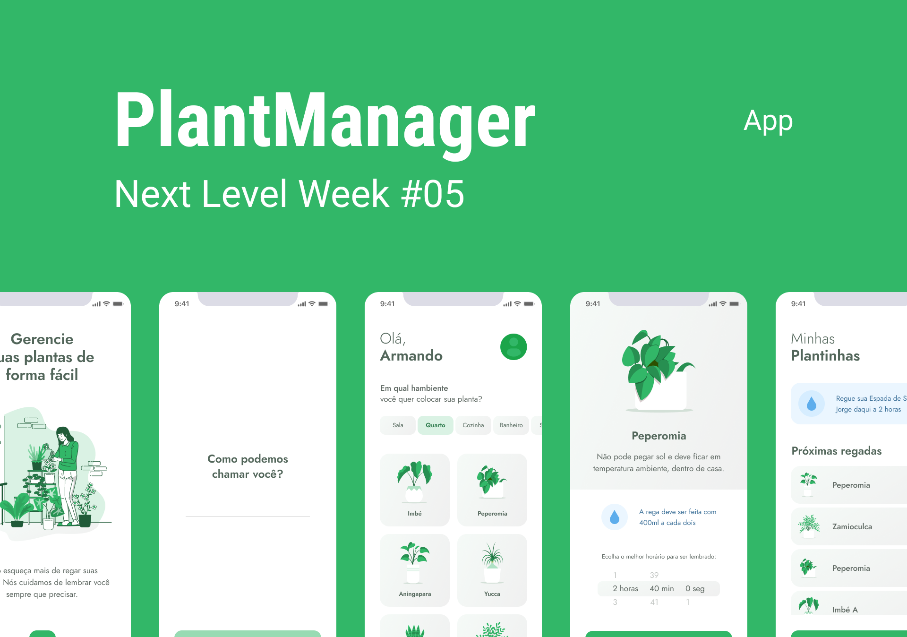

<h1
  align="center"
>
  
</h1>

### PlantManager é uma aplicação criada em React Native na 5ª edição do bootCamp da Rocketseat, Never Level Week, e tem como objetivo ajudar a cuidar melhor da nossas plantinhas em casa.

 

  <a
    href="#construindo-o-projeto"
  >
    Construindo o projeto
  </a>&nbsp;&nbsp;&nbsp;
  <a
    href="#screens"
  >
    Screens
  </a>&nbsp;&nbsp;&nbsp;
  <a
    href="#layout"
  >
    Layout
  </a>&nbsp;&nbsp;&nbsp;
  <a
    href="#tecnologias"
  >
  Tecnologias
  </a>&nbsp;&nbsp;&nbsp;
  <a
    href="#sobre-mim"
  >
  Sobre mim
  </a>

 

<h1
  align="center"
>
  
</h1>

### Contruindo o projeto

 

#### Aula 1 - Liftoff

- Apresentação do projeto e o que vamos desenvolver essa semana.
- ambiente de desenvolvimento e organização.
- O que é React Native e porque vamos usá-lo?
- Por que utilizar o Expo?
- Por que TypeScript?
- Criando o projeto React Native com TypeScript.
- Conceitos Importantes sobre: Componentes, Propriedades e Estados.
- Splash Screen e Tela de Welcome.

 

### Screens

 

### Layout

 

O layout original da aplicação no figma <a href="https://www.figma.com/file/IhQRtrOZdu3TrvkPYREzOy/PlantManager/duplicate" target="_blank">aqui</a>

 

### Tecnologias

  &nbsp;
  &nbsp;
  &nbsp;
  &nbsp;
    

### Sobre mim

 